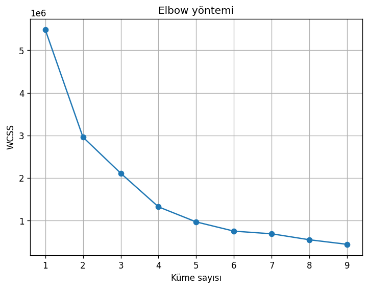
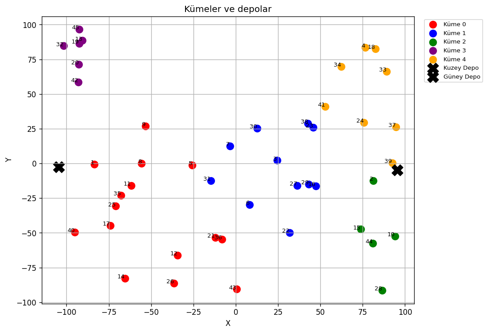
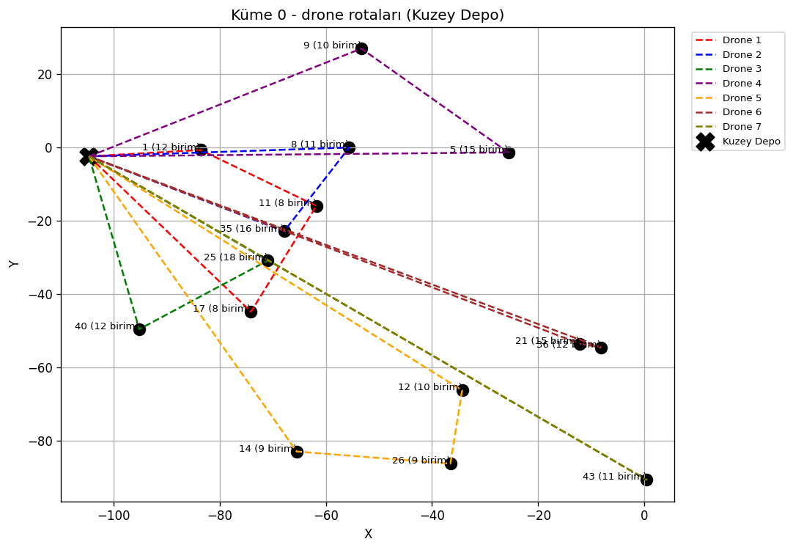

# Deprem Drone Rota Optimizasyonu

Deprem bölgesindeki yardım noktalarına drone ile malzeme dağıtımını planlayan bir
çalışma. Noktalar önce K-Means ile kümeleniyor, her küme kendisine daha yakın
olan depoya bağlanıyor, sonra küme içindeki noktalar drone kapasitesine sığan
turlara bölünüyor ve her turun ziyaret sırası kısaltılıyor.

Kısıtlar:

- İki depo var: Kuzey Depo ve Güney Depo.
- Bir drone en fazla 30 birim taşıyabiliyor.
- Bir drone birden fazla noktaya uğrayabiliyor, ama bir noktaya yalnızca bir
  drone gidiyor.
- Bir noktanın talebi bölünmüyor, tamamı tek seferde götürülüyor.

## Kurulum ve çalıştırma

Python 3.9 veya üstü gerekiyor.

```
git clone https://github.com/yapayogrenmeprojesi/Earthquake-Drone-Route-Optimization.git
cd Earthquake-Drone-Route-Optimization
pip install -r requirements.txt
python drone_rota.py
```

Betik hangi klasörden çağrılırsa çağrılsın veriyi `veri/` altından okuyor,
grafikleri ve rota listesini `cikti/` altına yazıyor. Pencere açmıyor, her şey
doğrudan dosyaya kaydediliyor.

| Seçenek | Ne yapıyor |
| --- | --- |
| `--kume-sayisi N` | K-Means küme sayısı (varsayılan 5) |
| `--kapasite N` | Bir dronun taşıyabileceği azami birim (varsayılan 30) |

## Veri

`veri/` klasöründe iki Excel dosyası var:

- `ihtiyac_noktalari.xlsx` — 47x47'lik mesafe matrisi. İlk iki satır ve sütun
  depolara, kalan 45'i ihtiyaç noktalarına ait. Matris simetrik, köşegeni sıfır
  ve bütün noktalar birbirine bağlı.
- `yardim_talepleri.xlsx` — her noktanın tıbbi malzeme ve yiyecek talebi. Toplam
  talep 522 birim; en küçük nokta 3, en büyüğü 19 birim istiyor.

522 birim ve 30 birimlik kapasiteyle en iyi ihtimalle 18 drone turu gerekiyor.

## Kümeleme

K-Means, noktaların koordinatları yerine mesafe matrisinin satırları üzerinde
çalışıyor: her nokta, diğer bütün noktalara olan uzaklıklarından oluşan bir
vektörle temsil ediliyor. Depo satırları kümelemeye girmiyor.

Küme sayısına Elbow yöntemiyle karar verildi. WCSS (Within-Cluster Sums of
Squares) her kümedeki noktaların küme merkezine olan uzaklıklarının karelerinin
toplamı. Küme sayısı arttıkça düşüyor, ama bir yerden sonra düşüş yavaşlıyor;
eğrinin kırıldığı yer 5 civarında.



Beş kümeyle 45 nokta 15, 11, 5, 6 ve 8 noktaya bölünüyor:



Grafiklerdeki X ve Y gerçek koordinat değil. Elimizde koordinat yok, yalnızca
mesafe matrisi var; çizim için MDS (Multidimensional Scaling) ile matrise uyan
yaklaşık bir düzlem yerleşimi üretiliyor. Bütün mesafe hesapları matrisin
kendisi üzerinden yapılıyor, MDS sadece grafikler için.

## Depo seçimi

Her küme, noktalarına ortalamada daha yakın olan depoya bağlanıyor. Bu
çalıştırmada 0 ve 3 numaralı kümeler Kuzey Depo'ya, 1, 2 ve 4 numaralı kümeler
Güney Depo'ya düştü.

## Rota kurma

Bir kümedeki toplam talep tek bir drona sığmadığı için küme, kapasiteye göre
turlara bölünüyor. Her tur depodan başlıyor, kalan noktalar arasından kapasiteye
sığan en yakını seçiliyor, sığan nokta kalmayınca depoya dönülüyor. Tur
tamamlandıktan sonra ziyaret sırası 2-opt ile iyileştiriliyor: turdaki iki kenar
seçilip aradaki parça ters çevriliyor, bu değişiklik turu kısaltıyorsa kabul
ediliyor ve kısaltan bir hamle kalmayana kadar sürüyor.



Son çalıştırmada 45 nokta 21 drone turuna bölündü, toplam mesafe 3801,3 çıktı.
Aynı noktalar tablodaki sırayla kapasiteye bölünüp o sırayla gezilseydi toplam
mesafe 4242,5 olacaktı; yani sıralama yüzde 10,4 kazandırıyor. Betik bu iki
sayıyı her çalıştırmada birlikte yazdırıyor.

Sonuç `cikti/drone_rotalari.csv` dosyasına yazılıyor. Sütunlar: küme numarası,
drone numarası, çıkış deposu, taşınan yük, tur mesafesi ve durak sırası.

```
Kume,Drone,Depo,Yuk,Mesafe,Rota
0,1,Kuzey Depo,28,131.31,Kuzey Depo -> Nokta 1 (12 birim) -> Nokta 11 (8 birim) -> Nokta 17 (8 birim) -> Kuzey Depo
```

## Neden A* yok

Projenin ilk sürümünde rotalar A* ile bulunmaya çalışılmıştı. İki nedenle
kaldırıldı:

Birincisi, o kod hiç çalışmıyordu. Kümeleme sonrası noktalar 1-45 arası sayılara
yeniden numaralandırılıyor, ama graf düğümlerinin adları "İhtiyaç Noktası 1"
gibi metinler olarak kalıyordu. Arama hedefi hiç bulamayıp her çağrıda `None`
döndürüyor, dolayısıyla genel grafiğe tek bir rota çizgisi bile çizilmiyordu.

İkincisi, elimizdeki graf tam bağlı bir mesafe matrisi ve üçgen eşitsizliğini
sağlıyor. Böyle bir grafta iki nokta arasındaki en kısa yol zaten aralarındaki
doğrudan kenar; en kısa yol araması hiçbir şey kazandırmıyor. Asıl problem
noktalar arasında yol bulmak değil, hangi noktaların aynı drona verileceği ve
hangi sırayla gezileceği. O yüzden yerine kapasiteye göre tur kurma ve 2-opt
kondu.

## Bilinen sınırlar

- Kümeleme mesafe matrisi satırları üzerinde yapılıyor. Bu, coğrafi yakınlığın
  makul bir karşılığı ama tam olarak aynı şey değil.
- Turlar önce en yakın komşu ile kuruluyor, sonra 2-opt uygulanıyor. İkisi de
  sezgisel; sonuç en iyi çözüm olmak zorunda değil, sadece iyi bir çözüm.
- Turlar küme küme kuruluyor. Farklı kümelerdeki iki komşu nokta aynı drona
  verilemiyor, bu da bazı turları gereksiz uzatıyor.
- Drone menzili, uçuş süresi ve şarj kısıtı hesaba katılmadı; tek kısıt kapasite.
- Küme sayısı Elbow eğrisine bakılarak elle seçiliyor, `--kume-sayisi` ile
  değiştirilebiliyor.

## Dosya düzeni

```
drone_rota.py     bütün çalışma: veri okuma, kümeleme, rota kurma, grafikler
veri/             mesafe matrisi ve talep tablosu (xlsx)
cikti/            üretilen grafikler ve drone_rotalari.csv
requirements.txt  matplotlib, openpyxl, pandas, scikit-learn
```

## Kaynakça

- [Makine Öğrenmesi - Clustering Kümeleme Teknikleri](https://samed-harman.medium.com/makine-%C3%B6%C4%9Frenmesi-clustering-k%C3%BCmeleme-teknikleri-bd1b59a0a177)
- [Elbow Method for Optimal Value of K in KMeans](https://www.geeksforgeeks.org/elbow-method-for-optimal-value-of-k-in-kmeans/)
- [2-opt](https://en.wikipedia.org/wiki/2-opt)
- [Multidimensional scaling](https://scikit-learn.org/stable/modules/manifold.html#multidimensional-scaling)

## Lisans

MIT. Ayrıntılar için [LICENSE](LICENSE) dosyasına bakın.
